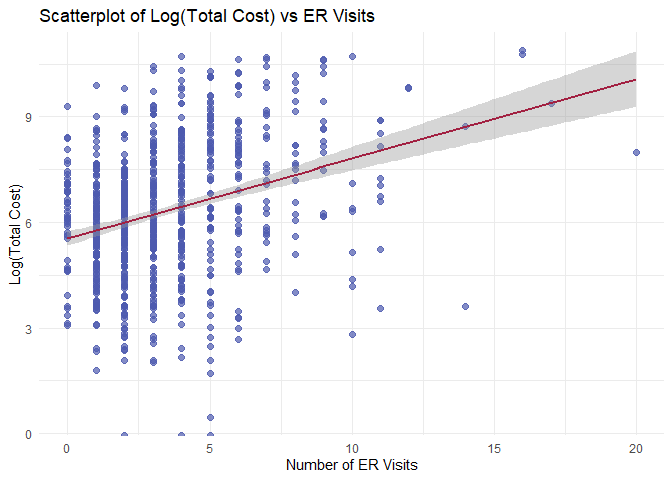

p8130_hw4_xx2485
================
Xiaoni Xu
2024-11-16

Loading needed packages

``` r
library(readxl)
library(janitor)
library(tidyverse)
library(knitr)
library(ggplot2)
```

## Problem 1

Perform sign test.

``` r
data <- c(125, 123, 117, 123, 115, 112, 128, 118, 124, 111, 116, 109, 
          125, 120, 113, 123, 112, 118, 121, 118, 122, 115, 105, 118, 131)

# Define the hypothesized median
median_hypothesis <- 120

# Count values above and below the hypothesized median
above <- sum(data > median_hypothesis)
below <- sum(data < median_hypothesis)

# Perform the sign test
binom_test <- binom.test(below, below + above, p = 0.5, alternative = "less")

# Report results
binom_test
```

    ## 
    ##  Exact binomial test
    ## 
    ## data:  below and below + above
    ## number of successes = 14, number of trials = 24, p-value = 0.8463
    ## alternative hypothesis: true probability of success is less than 0.5
    ## 95 percent confidence interval:
    ##  0.0000000 0.7536114
    ## sample estimates:
    ## probability of success 
    ##              0.5833333

We conducted an exact binomial test to evaluate whether the median blood
sugar level in the population is less than 120. The hypotheses were as
follows:

$$
H_0: \text{The true median is } \geq 120 \quad \text{(probability of success } = 0.5\text{)}.
$$ $$
H_a: \text{The true median is } < 120 \quad \text{(probability of success } > 0.5\text{)}.
$$

The test results are: - Number of successes (blood sugar readings below
120): $14$ - Number of trials: $24$ - p-value: $0.8463$ - 95% confidence
interval for the probability of success: $[0.000, 0.7536]$

Since the p-value ($0.8463$) is greater than the significance level
($\alpha = 0.05$), we fail to reject the null hypothesis.

Conclusion: There is no statistically significant evidence to suggest
that the median blood sugar level in the population is less than 120.

The test statistic is 10 as we use the smaller number of + and - signs,
given n (number of trials) \<= 25.

Perform Wilcoxon signed-rank test.

``` r
# Calculate differences from the hypothesized median
differences <- data - 120

# Remove zero differences
nonzero_differences <- differences[differences != 0]

# Rank absolute differences, handling ties with average ranks
abs_differences <- abs(nonzero_differences)
ranks <- rank(abs_differences)

# Sum ranks for negative differences
negative_ranks <- ranks[nonzero_differences < 0]
W_minus <- 10

# Calculate p-value using the normal approximation
n <- length(nonzero_differences)
mean_W <- n * (n + 1) / 4
sd_W <- sqrt(n * (n + 1) * (2 * n + 1) / 24)

z <- (W_minus - mean_W) / sd_W
p_value <- pnorm(z)

# Results
list(
  test_statistic = W_minus,
  p_value = p_value,
  z_score = z
)
```

    ## $test_statistic
    ## [1] 10
    ## 
    ## $p_value
    ## [1] 3.167124e-05
    ## 
    ## $z_score
    ## [1] -4

Since the p-value ($0.8580$) is greater than the significance level
($\alpha = 0.05$), we fail to reject the null hypothesis.

There is no statistically significant evidence to suggest that the
median blood sugar level in the population is less than 120.

## Problem 2

### (a)

``` r
# Load the data
brain <- read_excel("Brain.xlsx") %>% 
  clean_names()


# Filter out the human species (Homo sapiens)
nonhuman_data <- subset(brain, species != "Homo sapiens")

# Fit a regression model using ln_brain_mass as the predictor for glia_neuron_ratio
model <- lm(glia_neuron_ratio ~ ln_brain_mass, data = nonhuman_data)

# Summary of the regression model
summary(model)
```

    ## 
    ## Call:
    ## lm(formula = glia_neuron_ratio ~ ln_brain_mass, data = nonhuman_data)
    ## 
    ## Residuals:
    ##      Min       1Q   Median       3Q      Max 
    ## -0.24150 -0.12030 -0.01787  0.15940  0.25563 
    ## 
    ## Coefficients:
    ##               Estimate Std. Error t value Pr(>|t|)    
    ## (Intercept)    0.16370    0.15987   1.024 0.322093    
    ## ln_brain_mass  0.18113    0.03604   5.026 0.000151 ***
    ## ---
    ## Signif. codes:  0 '***' 0.001 '**' 0.01 '*' 0.05 '.' 0.1 ' ' 1
    ## 
    ## Residual standard error: 0.1699 on 15 degrees of freedom
    ## Multiple R-squared:  0.6274, Adjusted R-squared:  0.6025 
    ## F-statistic: 25.26 on 1 and 15 DF,  p-value: 0.0001507

The regression model shows that $\ln(\text{Brain Mass})$ is a
significant predictor of the glia-neuron ratio in nonhuman species
($p < 0.001$). The positive slope ($0.1811$) indicates that species with
larger brain masses (in terms of the natural logarithm) tend to have
higher glia-neuron ratios. The model explains a substantial portion of
the variability in the data ($R^2 = 0.6274$), making it a good fit for
the observed relationship.

### (b)

``` r
# Given human brain mass
human_brain_mass <- 1373.3

# Calculate the natural logarithm of human brain mass
ln_human_brain_mass <- log(human_brain_mass)

# Use the regression coefficients from the model to predict glia-neuron ratio
intercept <- 0.1637  # From the regression model
slope <- 0.1811      # From the regression model

# Predicted glia-neuron ratio
predicted_glia_neuron_ratio <- intercept + slope * ln_human_brain_mass

# Output the result
predicted_glia_neuron_ratio
```

    ## [1] 1.472142

The predicted glia-neuron ratio for humans, given their brain mass is
1.4721424.

### (c)

An interval for the **predicted mean glianeuron ratio at the given brain
mass** would be more relevant. We want to compare the human brain’s
glia-neuron ratio with the predicted mean of other primates, not with a
single new observation.

### (d)

``` r
# Construct a new data frame for prediction
new_data <- data.frame(ln_brain_mass = ln_human_brain_mass)

# Get prediction with confidence interval
ci <- predict(model, newdata = new_data, interval = "confidence", level = 0.95)

ci
```

    ##        fit      lwr      upr
    ## 1 1.472359 1.230103 1.714614

The **95% Confidence Interval** (CI) for the mean glia-neuron ratio at a
brain mass of 1373.3 g is: $$
[1.230, 1.715]
$$

This interval represents the plausible range for the **mean glia-neuron
ratio** of primates at this brain mass. Since the observed human
glia-neuron ratio ($1.65$) falls within this interval, human brain does
NOT have an excessive glia-neuron ratio for its mass compared with other
primates.

### (e)

- The human data point represents the largest brain mass and glia-neuron
  ratio in the dataset, at the edge of the range of nonhuman primate
  data.

  - This makes the prediction for humans effectively an extrapolation,
    as the regression model is based primarily on nonhuman primate data.
    Predictions for humans may be less reliable due to limited data in
    this range.

- The human data point is almost an outlier from the graph, both in
  terms of $\ln(\text{Brain Mass})$ and glia-neuron ratio.

  - Regression models are sensitive to outliers, which can
    disproportionately influence the slope and intercept of the
    regression line, potentially leading to biased results.

## Problem 3

### (a)

The main outcome is the number of emergency room (ER) visits, and the
main predictor is the total cost in dollars. Other important covariates
include age, gender, number of complications, and duration of treatment
condition.

``` r
# Load the dataset
heart_data <- read.csv("HeartDisease.csv")
```

Descriptive statistics for continuous variables:

``` r
# Select continuous variables
continuous_vars <- heart_data %>%
  select(totalcost, age, drugs, ERvisits, complications, comorbidities, duration)

# Function to calculate descriptive statistics for one variable
calculate_stats <- function(variable, var_name) {
  tibble(
    Statistic = c("Mean", "SD", "Min", "Max", "Median", "Q1", "Q3"),
    Value = c(
      mean(variable, na.rm = TRUE),
      sd(variable, na.rm = TRUE),
      min(variable, na.rm = TRUE),
      max(variable, na.rm = TRUE),
      median(variable, na.rm = TRUE),
      quantile(variable, 0.25, na.rm = TRUE),
      quantile(variable, 0.75, na.rm = TRUE)
    )
  ) %>%
    kable(caption = paste("Descriptive Statistics for", var_name), digits = 2)
}

# Generate tables for each continuous variable
for (var in colnames(continuous_vars)) {
  cat("\n### ", var, "\n")
  print(calculate_stats(continuous_vars[[var]], var))
}
```

    ## 
    ## ###  totalcost 
    ## 
    ## 
    ## Table: Descriptive Statistics for totalcost
    ## 
    ## |Statistic |    Value|
    ## |:---------|--------:|
    ## |Mean      |  2799.96|
    ## |SD        |  6690.26|
    ## |Min       |     0.00|
    ## |Max       | 52664.90|
    ## |Median    |   507.20|
    ## |Q1        |   161.12|
    ## |Q3        |  1905.45|
    ## 
    ## ###  age 
    ## 
    ## 
    ## Table: Descriptive Statistics for age
    ## 
    ## |Statistic | Value|
    ## |:---------|-----:|
    ## |Mean      | 58.72|
    ## |SD        |  6.75|
    ## |Min       | 24.00|
    ## |Max       | 70.00|
    ## |Median    | 60.00|
    ## |Q1        | 55.00|
    ## |Q3        | 64.00|
    ## 
    ## ###  drugs 
    ## 
    ## 
    ## Table: Descriptive Statistics for drugs
    ## 
    ## |Statistic | Value|
    ## |:---------|-----:|
    ## |Mean      |  0.45|
    ## |SD        |  1.06|
    ## |Min       |  0.00|
    ## |Max       |  9.00|
    ## |Median    |  0.00|
    ## |Q1        |  0.00|
    ## |Q3        |  0.00|
    ## 
    ## ###  ERvisits 
    ## 
    ## 
    ## Table: Descriptive Statistics for ERvisits
    ## 
    ## |Statistic | Value|
    ## |:---------|-----:|
    ## |Mean      |  3.43|
    ## |SD        |  2.64|
    ## |Min       |  0.00|
    ## |Max       | 20.00|
    ## |Median    |  3.00|
    ## |Q1        |  2.00|
    ## |Q3        |  5.00|
    ## 
    ## ###  complications 
    ## 
    ## 
    ## Table: Descriptive Statistics for complications
    ## 
    ## |Statistic | Value|
    ## |:---------|-----:|
    ## |Mean      |  0.06|
    ## |SD        |  0.25|
    ## |Min       |  0.00|
    ## |Max       |  3.00|
    ## |Median    |  0.00|
    ## |Q1        |  0.00|
    ## |Q3        |  0.00|
    ## 
    ## ###  comorbidities 
    ## 
    ## 
    ## Table: Descriptive Statistics for comorbidities
    ## 
    ## |Statistic | Value|
    ## |:---------|-----:|
    ## |Mean      |  3.77|
    ## |SD        |  5.95|
    ## |Min       |  0.00|
    ## |Max       | 60.00|
    ## |Median    |  1.00|
    ## |Q1        |  0.00|
    ## |Q3        |  5.00|
    ## 
    ## ###  duration 
    ## 
    ## 
    ## Table: Descriptive Statistics for duration
    ## 
    ## |Statistic |  Value|
    ## |:---------|------:|
    ## |Mean      | 164.03|
    ## |SD        | 120.92|
    ## |Min       |   0.00|
    ## |Max       | 372.00|
    ## |Median    | 165.50|
    ## |Q1        |  41.75|
    ## |Q3        | 281.00|

Descriptive statistics for categorical variables:

``` r
# Convert gender and interventions to factors
heart_data <- heart_data %>%
  mutate(
    gender = factor(gender, labels = c("Male", "Female")),
    interventions = as.factor(interventions)
  )

# Frequency tables for categorical variables
gender_table <- heart_data %>%
  group_by(gender) %>%
  summarise(Count = n()) %>%
  mutate(Percentage = Count / sum(Count) * 100)

interventions_table <- heart_data %>%
  group_by(interventions) %>%
  summarise(Count = n()) %>%
  mutate(Percentage = Count / sum(Count) * 100)

# Display frequency tables
print(gender_table)
```

    ## # A tibble: 2 × 3
    ##   gender Count Percentage
    ##   <fct>  <int>      <dbl>
    ## 1 Male     608       77.2
    ## 2 Female   180       22.8

``` r
print(interventions_table)
```

    ## # A tibble: 32 × 3
    ##    interventions Count Percentage
    ##    <fct>         <int>      <dbl>
    ##  1 0               128      16.2 
    ##  2 1               125      15.9 
    ##  3 2               110      14.0 
    ##  4 3                74       9.39
    ##  5 4                60       7.61
    ##  6 5                52       6.60
    ##  7 6                52       6.60
    ##  8 7                32       4.06
    ##  9 8                25       3.17
    ## 10 9                19       2.41
    ## # ℹ 22 more rows

### (b)

``` r
ggplot(heart_data, aes(x = totalcost)) +
  geom_histogram(binwidth = 1000, fill = "#4d5aaf", color = "black", alpha = 0.7) +
  labs(title = "Distribution of Total Cost", x = "Total Cost", y = "Frequency") +
  theme_minimal()
```

<!-- -->

Apply transformations:

``` r
# Apply log transformation (adding 1 to avoid log(0))
heart_data$totalcost_log <- log(heart_data$totalcost + 1)

# Apply square root transformation
heart_data$totalcost_sqrt <- sqrt(heart_data$totalcost)

# Apply inverse transformation (1/totalcost)
heart_data$totalcost_inv <- 1 / (heart_data$totalcost + 1)

# Plot transformed distributions
log_plot <- ggplot(heart_data, aes(x = totalcost_log)) +
  geom_histogram(binwidth = 0.5, fill = "#1e50a2", color = "black", alpha = 0.7) +
  labs(title = "Log-Transformed Total Cost", x = "Log(Total Cost)", y = "Frequency") +
  theme_minimal()

sqrt_plot <- ggplot(heart_data, aes(x = totalcost_sqrt)) +
  geom_histogram(binwidth = 1, fill = "#aacf53", color = "black", alpha = 0.7) +
  labs(title = "Square Root-Transformed Total Cost", x = "Square Root(Total Cost)", y = "Frequency") +
  theme_minimal()

inv_plot <- ggplot(heart_data, aes(x = totalcost_inv)) +
  geom_histogram(binwidth = 0.001, fill = "#a22041", color = "black", alpha = 0.7) +
  labs(title = "Inverse-Transformed Total Cost", x = "Inverse(Total Cost)", y = "Frequency") +
  theme_minimal()

# Display all plots
log_plot
```

<!-- -->

``` r
sqrt_plot
```

<!-- -->

``` r
inv_plot
```

<!-- -->

The shape of the distribution for variable `totalcost` is extremely
right-skewed, but after log transformation, it follows roughly a normal
distribution shape.

### (c)

``` r
heart_data <- heart_data %>%
  mutate(comp_bin = ifelse(complications == 0, 0, 1))
```

### (d)

``` r
# Create scatterplot with regression line
ggplot(heart_data, aes(x = ERvisits, y = log(totalcost))) +
  geom_point(color = "#4d5aaf", size = 2, alpha = 0.7) +
  geom_smooth(method = "lm", color = "#a22041", se = TRUE) +
  labs(title = "Scatterplot of Log(Total Cost) vs ER Visits",
       x = "Number of ER Visits",
       y = "Log(Total Cost)") +
  theme_minimal()
```

    ## `geom_smooth()` using formula = 'y ~ x'

    ## Warning: Removed 3 rows containing non-finite outside the scale range
    ## (`stat_smooth()`).

<!-- -->

``` r
# Fit a simple linear regression model
log_model <- lm(log(totalcost + 1) ~ ERvisits, data = heart_data)


# Summary of regression results
model_summary <- summary(log_model)
```

The p-value for the slope coefficient of `ERvisits` is 1.842^{-19},
which is less than the significance level of 0.05. This indicates that
the slope is statistically significant. Therefore, there is strong
evidence that the number of ER visits is associated with the
log-transformed total cost.

The regression equation based on the output is: $$
\text{Log(Total Cost + 1)} = 5.527 + 0.2253 \cdot \text{ERvisits}
$$

The slope coefficient for `ERvisits` is 0.2253. This means that for
every additional ER visit, the log-transformed total cost is expected to
increase by approximately 0.2253 units on average.

### (e)

``` r
# Fit the multiple linear regression model
mlr_model <- lm(formula = log(heart_data$totalcost + 1) ~ heart_data$ERvisits * heart_data$comp_bin)

mlr_model
```

    ## 
    ## Call:
    ## lm(formula = log(heart_data$totalcost + 1) ~ heart_data$ERvisits * 
    ##     heart_data$comp_bin)
    ## 
    ## Coefficients:
    ##                             (Intercept)  
    ##                                 5.48849  
    ##                     heart_data$ERvisits  
    ##                                 0.20947  
    ##                     heart_data$comp_bin  
    ##                                 2.19096  
    ## heart_data$ERvisits:heart_data$comp_bin  
    ##                                -0.09753

From the regression model, the interaction term
`heart_data$ERvisits:heart_data$comp_bin` has a coefficient of -0.09753
and a p-value of 0.311.

The p-value is greater than 0.05, indicating that the interaction term
is not statistically significant. Thus, `comp_bin` does not modify the
relationship between `totalcost` and `ERvisits`.

Test if comp_bin is a confounder of the relationship between totalcost
and ERvisits.

``` r
# Model 1: Without `comp_bin`
model_no_comp <- lm(log(heart_data$totalcost + 1) ~ heart_data$ERvisits, data = heart_data)

# Model 2: Including `comp_bin`
model_with_comp <- lm(log(heart_data$totalcost + 1) ~ heart_data$ERvisits + heart_data$comp_bin, data = heart_data)

# Summaries of the models
summary_no_comp <- summary(model_no_comp)
summary_no_comp
```

    ## 
    ## Call:
    ## lm(formula = log(heart_data$totalcost + 1) ~ heart_data$ERvisits, 
    ##     data = heart_data)
    ## 
    ## Residuals:
    ##     Min      1Q  Median      3Q     Max 
    ## -6.6532 -1.1230  0.0309  1.2797  4.2964 
    ## 
    ## Coefficients:
    ##                     Estimate Std. Error t value Pr(>|t|)    
    ## (Intercept)          5.52674    0.10510  52.584   <2e-16 ***
    ## heart_data$ERvisits  0.22529    0.02432   9.264   <2e-16 ***
    ## ---
    ## Signif. codes:  0 '***' 0.001 '**' 0.01 '*' 0.05 '.' 0.1 ' ' 1
    ## 
    ## Residual standard error: 1.799 on 786 degrees of freedom
    ## Multiple R-squared:  0.09844,    Adjusted R-squared:  0.09729 
    ## F-statistic: 85.82 on 1 and 786 DF,  p-value: < 2.2e-16

``` r
summary_with_comp <- summary(model_with_comp)
summary_with_comp
```

    ## 
    ## Call:
    ## lm(formula = log(heart_data$totalcost + 1) ~ heart_data$ERvisits + 
    ##     heart_data$comp_bin, data = heart_data)
    ## 
    ## Residuals:
    ##     Min      1Q  Median      3Q     Max 
    ## -6.5249 -1.0769 -0.0074  1.1847  4.4024 
    ## 
    ## Coefficients:
    ##                     Estimate Std. Error t value Pr(>|t|)    
    ## (Intercept)          5.51020    0.10279  53.606  < 2e-16 ***
    ## heart_data$ERvisits  0.20295    0.02405   8.437  < 2e-16 ***
    ## heart_data$comp_bin  1.70573    0.27915   6.111 1.56e-09 ***
    ## ---
    ## Signif. codes:  0 '***' 0.001 '**' 0.01 '*' 0.05 '.' 0.1 ' ' 1
    ## 
    ## Residual standard error: 1.759 on 785 degrees of freedom
    ## Multiple R-squared:  0.1394, Adjusted R-squared:  0.1372 
    ## F-statistic: 63.57 on 2 and 785 DF,  p-value: < 2.2e-16

Compare the coefficients.

``` r
# Extract coefficients for `ERvisits`
coef_no_comp <- summary_no_comp$coefficients["heart_data$ERvisits", "Estimate"]
coef_with_comp <- summary_with_comp$coefficients["heart_data$ERvisits", "Estimate"]

# Calculate percent change
percent_change <- abs((coef_with_comp - coef_no_comp) / coef_no_comp) * 100

# Display results
cat("Coefficient of ERvisits without comp_bin:", round(coef_no_comp, 4), "\n")
```

    ## Coefficient of ERvisits without comp_bin: 0.2253

``` r
cat("Coefficient of ERvisits with comp_bin:", round(coef_with_comp, 4), "\n")
```

    ## Coefficient of ERvisits with comp_bin: 0.2029

``` r
cat("Percent change in coefficient:", round(percent_change, 2), "%\n")
```

    ## Percent change in coefficient: 9.92 %

Conclusion: The percent change in the coefficient of ERvisits is less
than 10% (9.92%). This suggests that comp_bin is not a significant
confounder of the relationship between totalcost and ERvisits.

`comp_bin` should be included along with `ERvisits`. `comp_bin` is a
statistically significant predictor, so it improves the explanatory
power of the model. It does not act as a confounder either.

Adding `comp_bi`n provides additional information about `totalcost`
without distorting the relationship between `ERvisits` and `totalcost`.

### (f)

``` r
# Fit the MLR model with additional covariates
mlr_model_extended <- lm(log(totalcost + 1) ~ ERvisits + comp_bin + age + gender + duration, data = heart_data)

# Show the regression results
summary(mlr_model_extended)
```

    ## 
    ## Call:
    ## lm(formula = log(totalcost + 1) ~ ERvisits + comp_bin + age + 
    ##     gender + duration, data = heart_data)
    ## 
    ## Residuals:
    ##     Min      1Q  Median      3Q     Max 
    ## -5.4711 -1.0340 -0.1158  0.9493  4.3372 
    ## 
    ## Coefficients:
    ##                Estimate Std. Error t value Pr(>|t|)    
    ## (Intercept)   5.9404610  0.5104064  11.639  < 2e-16 ***
    ## ERvisits      0.1745975  0.0225736   7.735 3.20e-14 ***
    ## comp_bin      1.5044946  0.2584882   5.820 8.57e-09 ***
    ## age          -0.0206475  0.0086746  -2.380   0.0175 *  
    ## genderFemale -0.2067662  0.1387002  -1.491   0.1364    
    ## duration      0.0057150  0.0004888  11.691  < 2e-16 ***
    ## ---
    ## Signif. codes:  0 '***' 0.001 '**' 0.01 '*' 0.05 '.' 0.1 ' ' 1
    ## 
    ## Residual standard error: 1.624 on 782 degrees of freedom
    ## Multiple R-squared:  0.2694, Adjusted R-squared:  0.2647 
    ## F-statistic: 57.68 on 5 and 782 DF,  p-value: < 2.2e-16

F-statistic and overall significance:

- The overall F-statistic is 57.68, with a p-value of 782 ($p < 0.05$).

- This shows that the model is statistically significant and that the
  predictors collectively explain variability in log-transformed total
  cost.

Comments on Individual Predictors

1.  ERvisits:

    - Coefficient: 0.1746

    - $p$-value: 3.197^{-14}

    - Interpretation: ER visits are significantly increase
      log-transformed total cost ($p < 0.05$).

2.  comp_bin:

    - Coefficient: 1.504

    - $p$-value: 8.566^{-9}

    - Interpretation: Complications significantly increase
      log-transformed total cost ($p < 0.05$).

3.  age:

    - Coefficient: -0.02065

    - $p$-value: 0.01754

    - Interpretation: Age significantly increase log-transformed total
      cost ($p < 0.05$).

4.  gender:

    - Coefficient: -0.2068

    - $p$-value: 0.1364

    - Interpretation: Gender is not statistically significant
      ($p = 0.1364$).

5.  duration:

    - Coefficient: 0.005715

    - $p$-value: 3.258^{-29}

    - Interpretation: Duration significantly increase log-transformed
      total cost ($p < 0.05$).

The model explains approximately 27% of the variability in
log-transformed total cost. `ERvisits`, `comp_bin`, `age`, and
`duration` are statistically significant, while `gender` is not.
Duration has the strongest positive association with log-transformed
total cost, followed by `comp_bin` and `ERvisits`.

Compare the SLR and MLR models.

Key Metrics from SLR Model

1.  Residual Standard Error: 1.799

2.  $R^2$: 0.09844 (approximately 9.8% of variability in total cost
    explained by ER visits alone).

3.  ERvisits Coefficient:

    - Estimate: 0.2253
    - $p$-value: 1.842^{-19}
    - Interpretation: The SLR model shows a statistically significant
      positive association between ER visits and total cost
      ($p < 0.05$).

Key Metrics from MLR Model

1.  Residual Standard Error: 1.624

2.  $R^2$: 0.2694 (approximately 27% of variability in total cost
    explained by ER visits along with other predictors).

3.  Adjusted $R^2$: 0.2647.

4.  ERvisits Coefficient:

    - Estimate: 0.1746
    - $p$-value: 3.197^{-14}
    - Interpretation: Even after adjusting for `comp_bin`, `age`,
      `gender`, and `duration`, ER visits remain a statistically
      significant positive predictor of total cost ($p < 0.05$).

The **MLR model** would be used to address the objective because it has
a larger $R^2$ value. $R^2$ represents the proportion of variance
explained by model.
